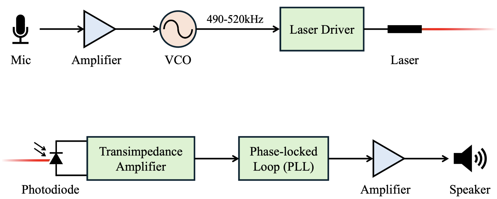

# Laser Audio-Communication System
Audio communication through a frequency-modulated laser implemented fully in the analog domain (MIT Analog Electronics Lab Final Project).
([Report](Laser_Audio_Communication_System__6_2040_Project_.pdf), [Video](https://youtu.be/VvL-cQdRXIU?si=kM2XvpVXku9nrI-7))

